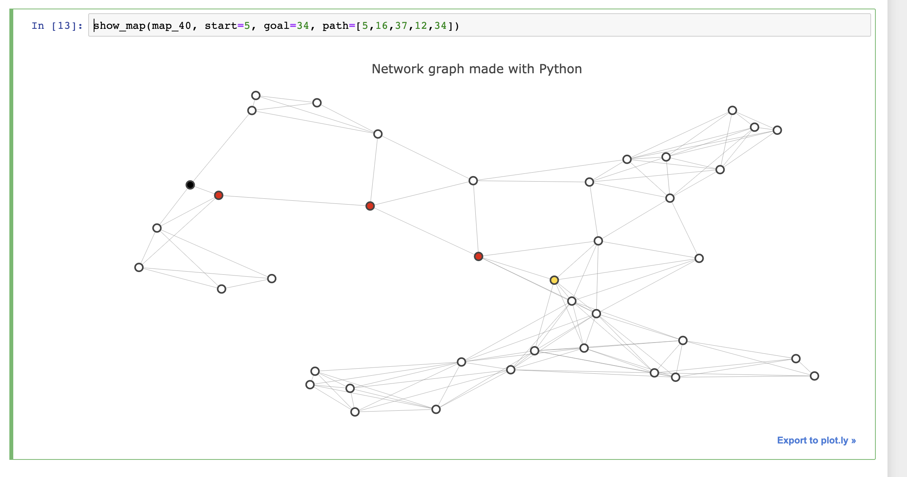
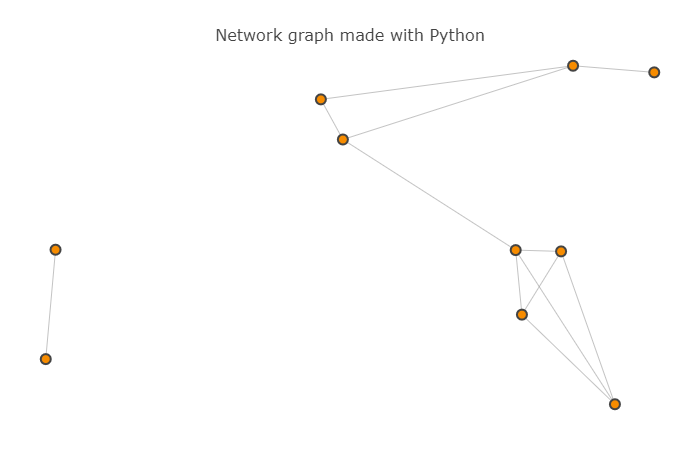
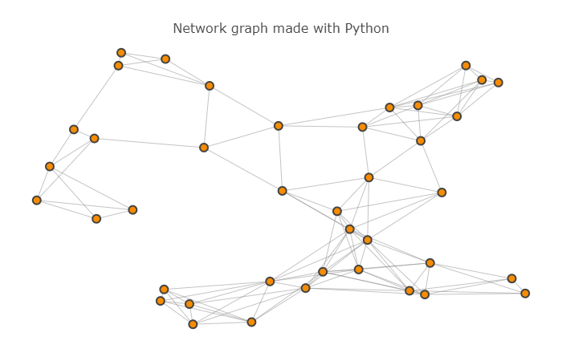

# Route_Planner

Building a route-planning algorithm like the one used in Google Maps to calculate the shortest path between two points on a map.

### Algorithm 

In this project, I've applied A* search to implement a "Google-maps" style route planning algorithm and find the shortest path between two points.

### This project includes the following files:

1. helpers.py - Contains helper functions for loading and displaying the maps.
2. map-10.pickle - Contains the map with 10 nodes.
3. map-40.pickle - Contains the map with 40 nodes.
4. Route Planner.ipynb - Jupyter notebook that contains all the instructions for the project
5. test.py - Contains function for testing the route planner implementation.
6. student_code - Contains Implemented algorithm to find the required shortest path.

### Maps Used

